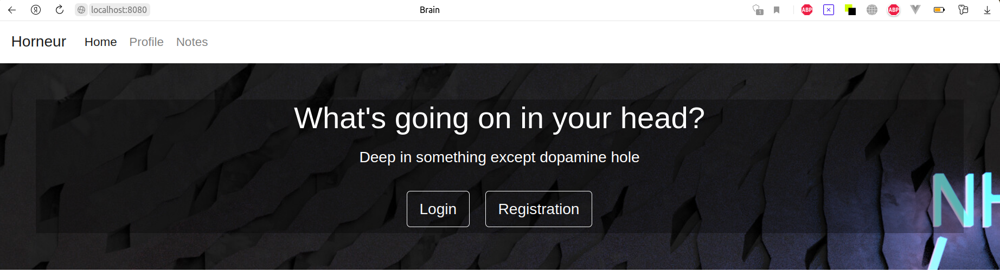
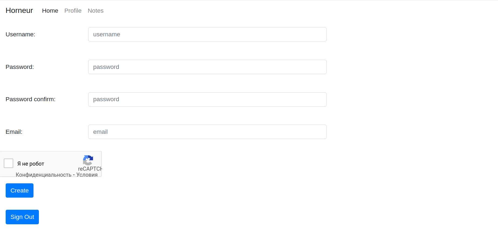
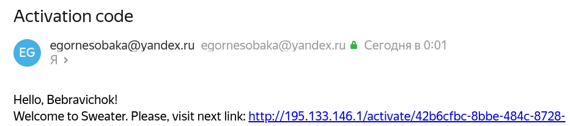
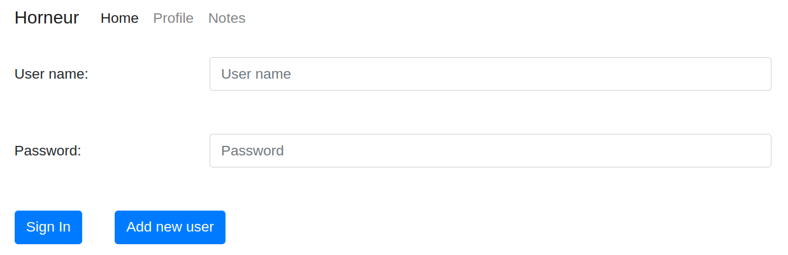
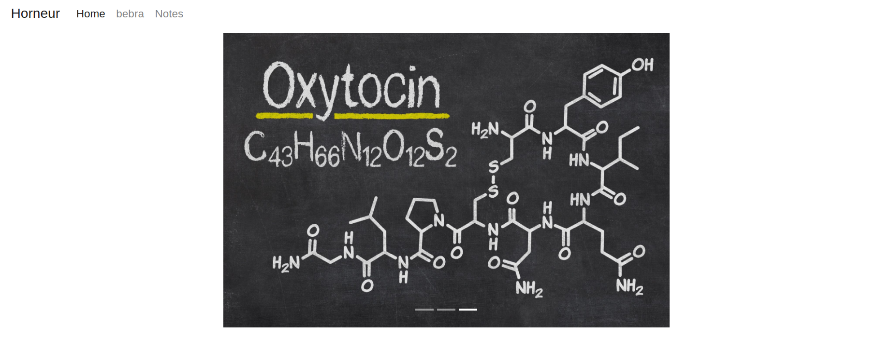
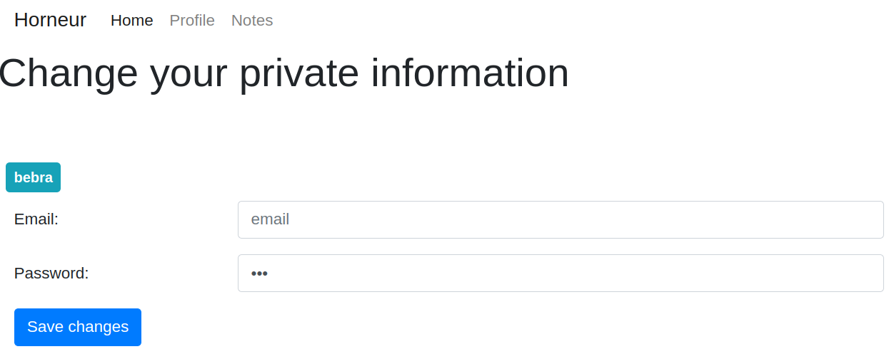
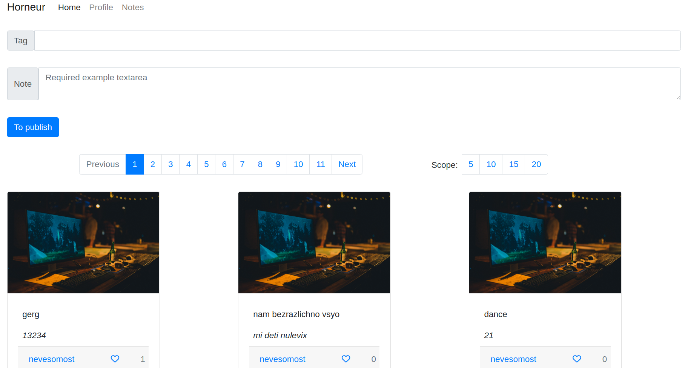
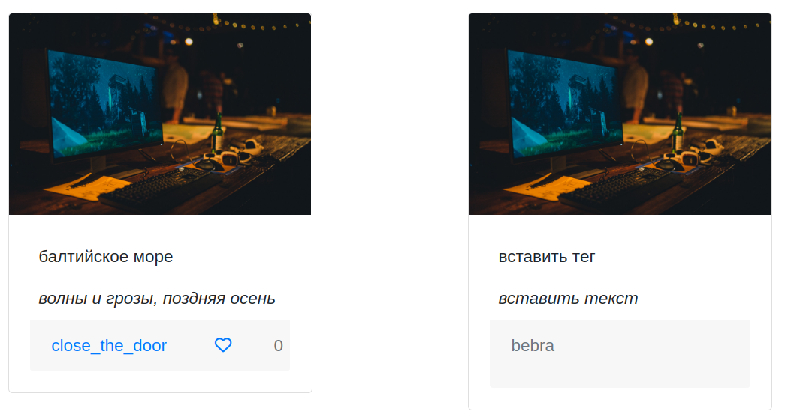

## Гормоны и нейромедиаторы

#### *Проект, созданный для отслеживания собственного состояния в заметках и картинках*

 :heavy_check_mark: Создать домашнюю страницу, регистрации и авторизации \
 :heavy_check_mark: Настроить JMS \
 :heavy_check_mark: Создать navbar&sidebar \
 :heavy_check_mark: Файл-проперти с настройкой подключения к бд \
 :heavy_check_mark: Настройка Security с помощью **WebSecurityConfigurerAdapter**. \
 :heavy_check_mark: Настроить капчу \
 :heavy_check_mark: Настроить миграции(flyway) \
 :heavy_check_mark: Spring session jdbc \
 :heavy_check_mark: Страница создания записи и отображение записей других пользователей \
 :heavy_check_mark: Настроить веб-сокеты под нажатие лайков \
 :heavy_check_mark: Пагинация \ 

____

Страница приветствия, на которой виден navbar, sidebar. С неё же можно перейти и на страницу регистрации с логином.
Пока регистрация/авторизация не будет пройдена, никуда перейти отсюда будет нельзя.

____  

Простецкая регистрация. На ней видно применение открытого API гугла в виде капчи. 

После регистрации на указанный email придёт письмо с ссылкой-подтверждением:

____

После перехода по ссылке видим авторизацию, не отличающуюся хитроостью:

____

Попадаем на главную страницу:

____

Страница профиля

____

Вот и страница, на которой можно сделать запись. Тут же видно и пагинацию

____

Сравниваем отображение 2 записей:

____

При переходе на профиль видим кнопку "подписаться"(на бд-side реализовано связью one-to-many):

 

